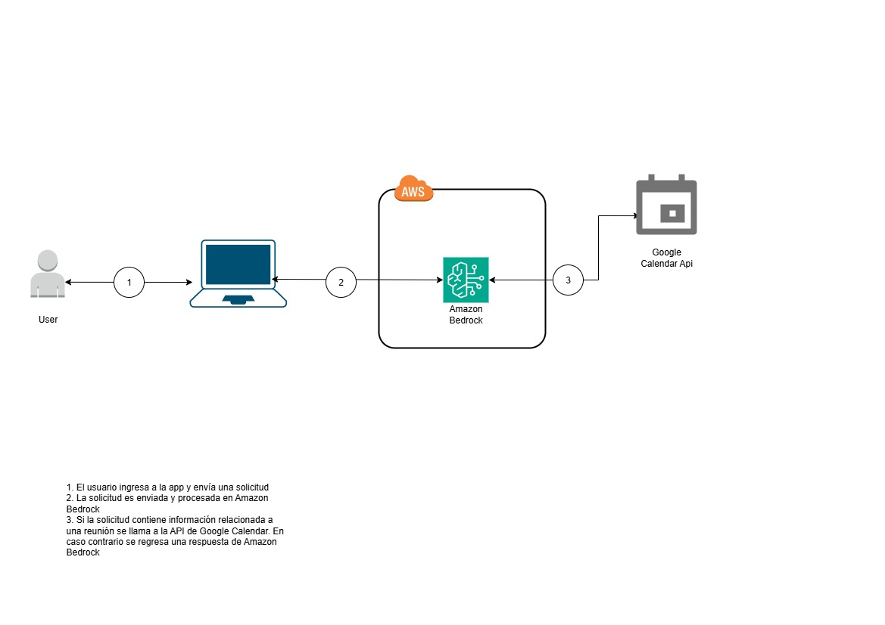

# asistente-bedrock
# Asistente Personal con Amazon Bedrock y Streamlit

Es un asistente personal inteligente desarrollado en Streamlit que combina IA Generativa (AWS Bedrock) con la integración de Google Calendar.

Su objetivo es ayudar al usuario a organizar su vida diaria de manera intuitiva y conversacional, utilizando voz o texto. Nova es capaz de:

   - Conversar de forma natural con el usuario.

   - Detectar eventos y recordatorios en el diálogo y agendarlos automáticamente en Google Calendar.

   - Adaptarse a las preferencias, intereses y estilo de comunicación del usuario.

   - Gestionar tareas pendientes con alertas inteligentes.

Un asistente personal inteligente construido con:

- [Amazon Bedrock](https://aws.amazon.com/bedrock/) (Claude v2)
- Python + Streamlit
- AWS SDK (boto3)
# Infrastructura



# Clonar repositorio

1. Clona este repositorio:
   ```bash
   git clone https://github.com/tu-usuario/asistente-bedrock.git

# Requirements 

### Python 
   - [Version 3.12](https://www.python.org/downloads/)

### Streamlit
   - [Vesion 1.48.0](https://docs.streamlit.io/get-started/installation)

### Boto3 
   - [Version 1.24.96](https://pypi.org/project/boto3/1.24.96/)

### Google api Client
   - [Version 2.179.0](https://developers.google.com/workspace/docs/api/how-tos/libraries?hl=es-419#python)

### Google Auth httplib2
   - [Version 0.2.0](https://pypi.org/project/google-auth-httplib2/)

### Google Auth OAuthlib
   - [Version 1.2.2](https://pypi.org/project/google-auth-oauthlib/)

### Dateparser
   - [Version 1.2.2](https://pypi.org/project/dateparser/)

### st audiorec
   - [Version  0.1.3](https://pypi.org/project/streamlit-audiorec/)

# Entorno

```bash 
pipenv shell 
pip install -r requirements.txt
```
# Ejecutar proyecto localmente

```bash 
streamlit run bedrock_api.py
```

